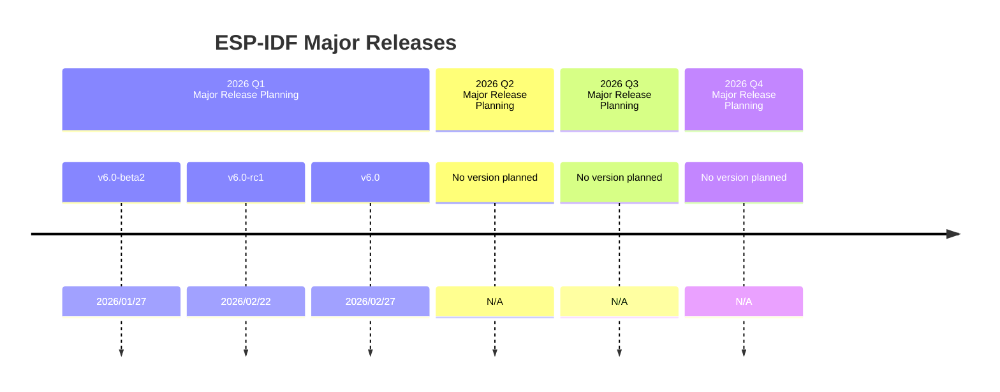
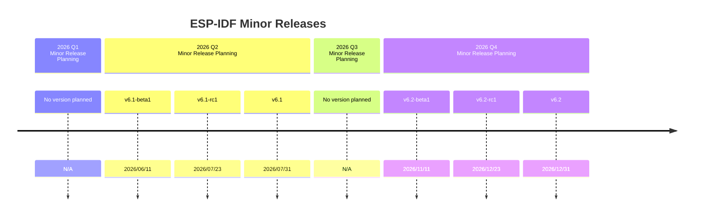
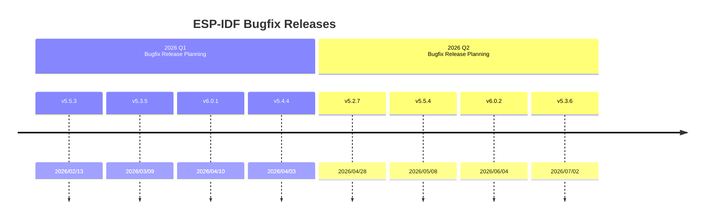

# ESP-IDF Project Roadmap 2026 

* [中文版](./ROADMAP_CN.md)

This document outlines the goals of ESP-IDF project and is shared for the convenience of our customers. It is important to clarify that this document is not a binding commitment to our customers. Instead, its primary purpose is to offer a clear roadmap and direction for the project's development. By openly sharing this information, we aim to enhance our customers' understanding, promote transparency and ensure alignment with the overarching objectives of the ESP-IDF project.

## Project Overview

### Project Goals

In both minor and major releases, we integrate new chip support to enhance our product range. By expanding the chip matrix, we broaden the scope of our offerings, catering to a wider audience with diverse needs. This proactive approach ensures that our products remain at the forefront of technological advancements, consistently meeting and exceeding customer expectations.

Furthermore, we prioritize bugfix releases for active branches, focusing on improving the stability and performance of products already in production. By addressing bugs promptly, we aim to enhance the overall user experience and provide tangible benefits to customers relying on our solutions. This proactive maintenance strategy reflects our commitment to delivering reliable, high-quality products to our valued customer base.

Below are the main objectives that ESP-IDF project/teams would like to implement in 2026.

-   New Chip Support
    -   Add support for ESP32-H21
    -   Add support for ESP32-H4

-   More Minor/Major Releases

    -   Release IDF v6.0 in Q1 of 2026
    -   Release IDF v6.1 in the middle of 2026
    -   Release IDF v6.2 in the end of 2026

-   More Bugfix Releases

    -   Release v5.2.7 and v5.2.8 before ESP-IDF v5.2 goes End of Life in August 2026
    -   Release v5.3.5, v5.3.6 and v5.3.7 before ESP-IDF v5.3 goes End of Life in January 2027
    -   Do more bugfix releases for IDF v5.4 and IDF v5.5 before release/5.4 and release/5.5 enter maintenance period
    -   Do more bug fixes releases for release/6.0 and release/6.1, and push it to be more stable and production-ready

-   Major Changes

    -   ESP-IDF v6.0 is upgrading to MbedTLS v4.x and the new PSA Crypto API. This work is still in progress, so upcoming beta(s) or RC releases may include further updates or breaking changes to crypto APIs.

Please note that support status of previous silicones could be found on [ESP-IDF Release and SoC Compatibility](https://github.com/espressif/esp-idf#esp-idf-release-and-soc-compatibility).

### Roadmap Details

The ESP-IDF project prioritizes consistent maintenance and updates to ensure our customers remain at the forefront of technological advancements. Our commitment to ongoing development ensures that customers continuously benefit from the latest innovations in the field.

Moreover, we are dedicated to empowering our customers to leverage newly implemented features and enhanced functionalities through iterative improvements. Our steadfast commitment to pushing boundaries ensures that clients not only keep pace with evolving technology but also extract optimal value from the cutting-edge capabilities of our products.

Below are the main roadmap details for functional areas inside ESP-IDF.

-   New Chip Support

    -   Add initial support for the mass production version of ESP32-H21 once the chip reaches mass production readiness. Progress will be tracked via the [New chip support status page](https://developer.espressif.com/hardware/) on Developer Portal.
    -   Add initial support for the mass production version of ESP32-H4 once the chip reaches mass production readiness. Progress will be tracked via the [New chip support status page](https://developer.espressif.com/hardware/) on Developer Portal.

-   Bugfix releases

    -   Release v5.2.7 and v5.2.8 before ESP-IDF v5.2 goes End of Life in August 2026
    -   Release v5.3.5, v5.3.6 and v5.3.7 before ESP-IDF v5.3 goes End of Life in January 2027
    -   Push release/5.4 to maintenance period from January 2026, and release bugfix IDF v5.4.4, IDF v5.4.5 in 2026 
    -   Release bugfix IDF v5.5.3, IDF v5.5.4, IDF v5.5.5, IDF v5.5.6 and IDF v5.5.7 in 2026, and push release/5.5 to maintenance period from July 2026
    -   Do more bug fixes releases for release/6.0, and push the release to be more stable and more production-ready

## ESP-IDF Planning information

For the full list of ESP-IDF releases, please visit https://github.com/espressif/esp-idf/releases

All the information provided here is subject to change without notice, due to business reasons and other factors.

### ESP-IDF Major Releases


  
### ESP-IDF Minor Releases



### ESP-IDF Bugfix Releases



 ```mermaid
timeline

        section 2026 Q3 <br> Bugfix Release Planning
          v5.5.5 : 2026/07/30
          v5.2.8 : 2026/08/17
          v6.1.1 : 2026/09/03   
          v6.0.3 : 2026/09/10
          v5.4.5 : 2026/09/28
        section 2026 Q4 <br> Bugfix Release Planning
          v5.5.6 : 2026/10/08
          v6.1.2 : 2026/10/22
          v6.0.4 : 2026/11/18
          v6.1.3 : 2026/12/16         
          v5.5.7 : 2027/01/11
          v5.3.7 : 2027/01/18   
```